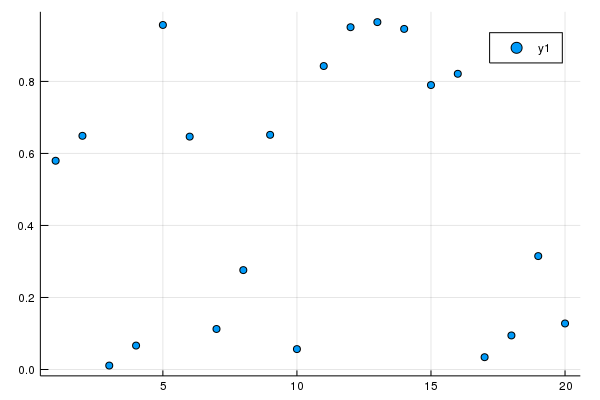

# Table of Contents

- [What is Reproducible.jl?](#what-is-reproducible.jl)
- [Usage](#usage)
- [Built-in Renderers](#built-in-renderers)
- [Markdown](#markdown)
- [Code Blocks of Other Languages](#code-blocks-of-other-languages)
- [Custom Renderers](#custom-renderers)
    - [Custom Renderer Example](#custom-renderer-example)
- [Render Tests](#render-tests)
    - [Test 1](#test-1)
    - [Test 2](#test-2)
    - [Test 3](#test-3)
- [Plot Example](#plot-example)


---

# What is Reproducible.jl?

**[Reproducible.jl](https://github.com/joshday/Reproducible.jl) is a lightweight Julia package for creating reproducible reports.** 

  * You **write markdown** and **Reproducible** generates another markdown file with "rendered" code blocks.
  * Basic syntax:

````
```julia; <renderer>
x = 1
```
````

If you are already familiar with the fantastic [Documenter.jl](https://github.com/JuliaDocs/Documenter.jl)  package, think of **Reproducible** as a customizable way to write `@example`, `@repl`, etc. blocks.

# Usage

To render the code blocks in a `source` file, use the `Reproducible.build` function:

`Reproducible.build(source, <builddir>; frontmatter="", toc=false)`

Note that **Reproducible** uses Julia's `Markdown` package in the standard library, which does not parse YAML frontmatter, e.g.

```
---
title: Introduction
author: Josh Day
---
```

To work around this, `frontmatter` can be passed as a keyword argument to `build` e.g. `build(src; frontmatter = "title:Introduction\nauthor:Josh Day")`

# Built-in Renderers

Renderers are meant to be customizable (see the [Renderers](renderers.md) section), but there are some built into **Reproducible**:

  * **`run`**: Run the block and insert the source code.

```julia
x = "This is rendered via `julia; run;`"
```

  * **`hide`**: Run the block, but hide the source code.


  * **`block`**: Run the block and insert the source code and output of the last line.

```
x = "This is rendered via `julia; block;`"
```

```julia
"This is rendered via `julia; block;`"
```

  * **`repl`**: Treat block as if it were entered into the Julia REPL.

```julia
julia> x = "This is rendered via `julia; repl;`"
"This is rendered via `julia; repl;`"
```

# Markdown

Reproducible uses Julia's standard library `Markdown` package to parse a markdown file, so any  valid markdown syntax is fair game.  

| Here |  is |   a | table |
| ----:| ---:| ---:| -----:|
|    A |   B |   C |     D |

  * Here
  * is
  * a
  * list

```julia
# here is some julia code with syntax highlighting

f(x) = x ^ 2

mutable struct MyStruct
    a::Int
end
```

# Code Blocks of Other Languages

Other languages will be left alone, but there's no reason the approach of **Reproducible** could not be extended via [PyCall](https://github.com/JuliaPy/PyCall.jl),  [RCall](https://github.com/JuliaInterop/RCall.jl), etc.

  * Input file:

````
```python
import pandas as pd
```
````

  * Output file:

```python
import pandas as pd
```

# Custom Renderers

**Reproducible** creates a `CodeBlock` object from markdown code blocks (see `?CodeBlock` and `?CodeRow`).

To create a custom renderer so that you can use 

````
```julia; myrenderer; ky1 = true, ky2 = 10
...
```
````

you should overload

```julia
Reproducible.render(o::CodeBlock, r::Val{:myrenderer}; ky1=true, ky2=1, kw...)
```

which should return the String that you wish to be inserted into the output document.

## Custom Renderer Example

Check the examples/make.jl file!  Now we can do

````
```julia;thing;
1 + 1
2 + 2
```
````

the output would look like:

```
The first line of your code was 1 + 1
```
```
The output of that line was 2
```

# Render Tests

## Test 1

**Render Test for block**:

````
```julia; block
x = 1

y = 2
```
````

```
x = 1

y = 2
```

```julia
2
```

**Render Test for repl**:

````
```julia; repl
x = 1

y = 2
```
````

```julia
julia> x = 1
1

julia> y = 2
2
```

**Render Test for run**:

````
```julia; run
x = 1

y = 2
```
````

```julia
x = 1

y = 2
```


## Test 2

**Render Test for block**:

````
```julia; block
x = 1;

y = 2
```
````

```
x = 1;

y = 2
```

```julia
2
```

**Render Test for repl**:

````
```julia; repl
x = 1;

y = 2
```
````

```julia
julia> x = 1;


julia> y = 2
2
```

**Render Test for run**:

````
```julia; run
x = 1;

y = 2
```
````

```julia
x = 1;

y = 2
```


## Test 3

**Render Test for block**:

````
```julia; block
randn(3,3)
```
````

```
randn(3,3)
```

```julia
3×3 Array{Float64,2}:
  0.867347  -0.902914   0.532813
 -0.901744   0.864401  -0.271735
 -0.494479   2.21188    0.502334
```

**Render Test for repl**:

````
```julia; repl
randn(3,3)
```
````

```julia
julia> randn(3,3)
3×3 Array{Float64,2}:
  0.867347  -0.902914   0.532813
 -0.901744   0.864401  -0.271735
 -0.494479   2.21188    0.502334
```

**Render Test for run**:

````
```julia; run
randn(3,3)
```
````

```julia
randn(3,3)
```


# Plot Example

```julia
using Plots
scatter(rand(20))
```




